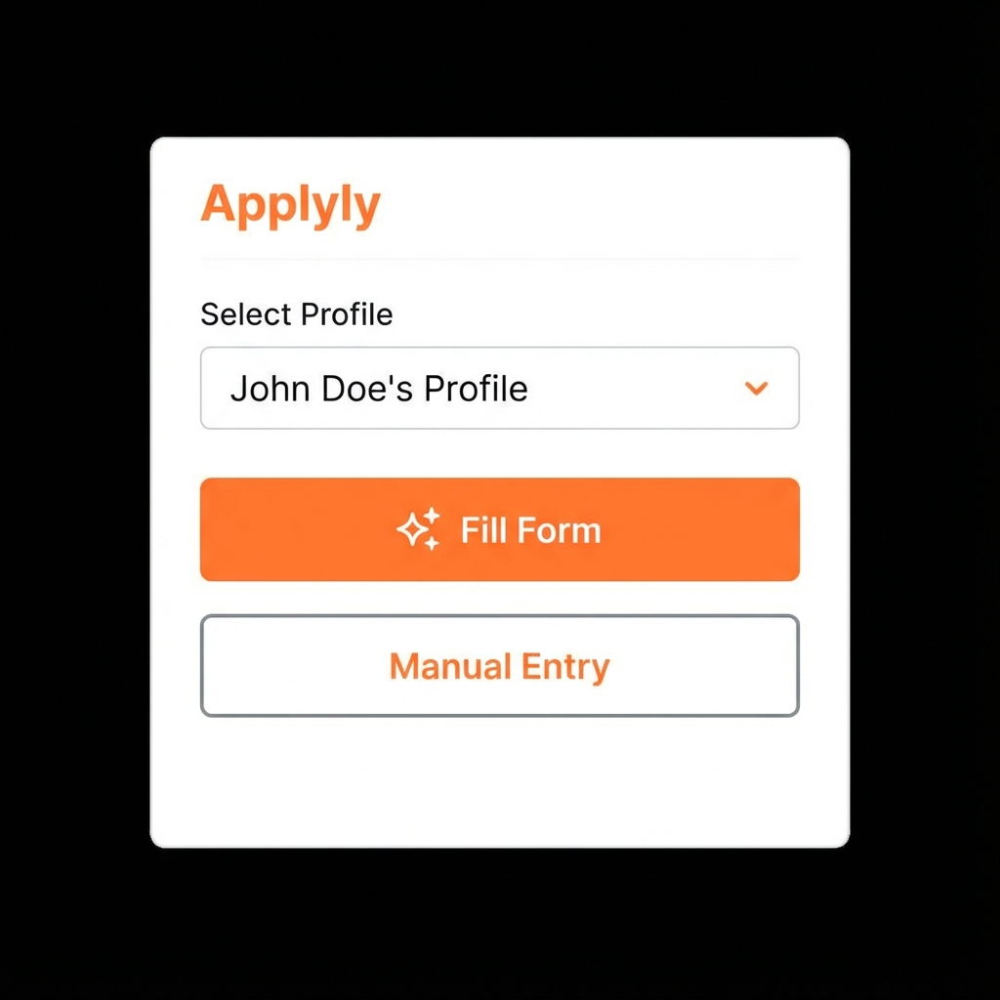
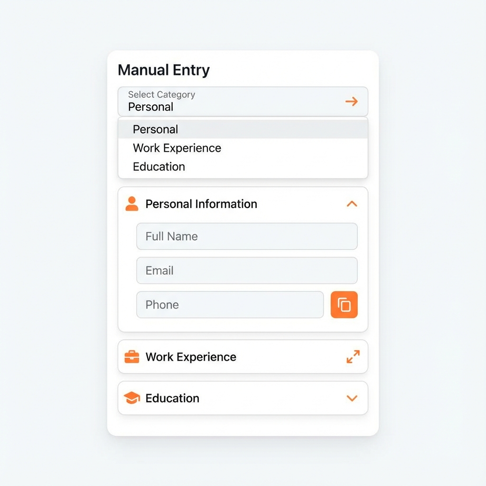
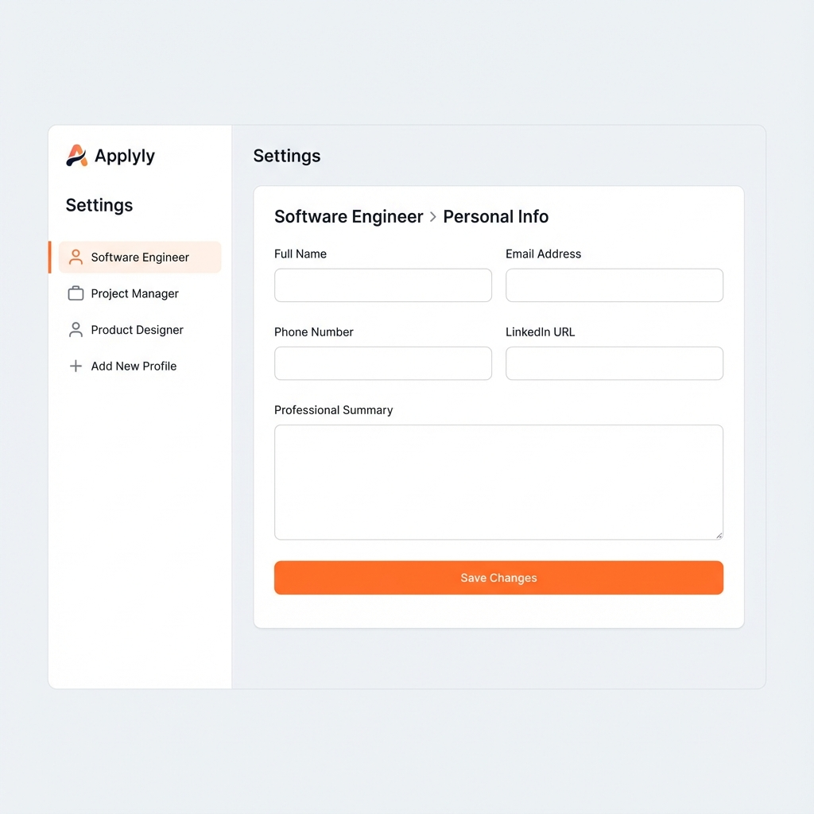

# Applyly™

Applyly™ is a free, open-source browser extension designed to streamline the process of filling out job applications. By securely storing and organizing resume data locally, it allows users to quickly populate repetitive form fields across various job portals without manual data entry.

## Overview

Applying for roles often involves re-entering the same information across dozens of different web forms. Applyly simplifies this by extracting and structuring your resume data, making it available for instant use through a clean interface that integrates directly with your browser.

## Features

- Robust form filling across multiple job portals and platforms.
- Intelligent field detection for iframes and Shadow DOM environments.
- Support for complex resume categories including Leadership, Grants, and Teaching.
- Manual entry helper for granular date components and specific field values.
- Privacy-first architecture with all data stored locally on your device.

## Installation

Applyly is currently available for manual installation in Chrome Developer Mode.

1.  Clone this repository to your local machine.
2.  Open Google Chrome and navigate to `chrome://extensions/`.
3.  Enable **Developer mode** using the toggle in the top right corner.
4.  Click **Load unpacked** and select the `dist` folder within the project directory.

## Permissions

Applyly requires the following permissions to function:

- `storage`: To securely store your resume profiles locally.
- `tabs`: To interact with job application pages and fill forms.
- `scripting`: To inject the form-filling logic into application portals.
- `activeTab`: To access the current page's DOM when you initiate a fill.

## Screenshots

*The Applyly popup interface for profile selection and manual entry.*

*Detailed manual entry helper for granular data copying.*

*The settings and profile management interface.*

## Roadmap

- Support for additional document types and parsing formats.
- Enhanced matching algorithms for non-standard application forms.
- Automated updates for community-sourced portal mappings.
- Localization for multiple languages and regions.

## Trademark

Applyly™ is a trademark of the project creator. The MIT License applies to the source code only. The name, branding, and visual assets are protected and may not be used for commercial purposes without explicit permission.

## License

This project is licensed under the MIT License. See the [LICENSE](LICENSE) file for the full text.
