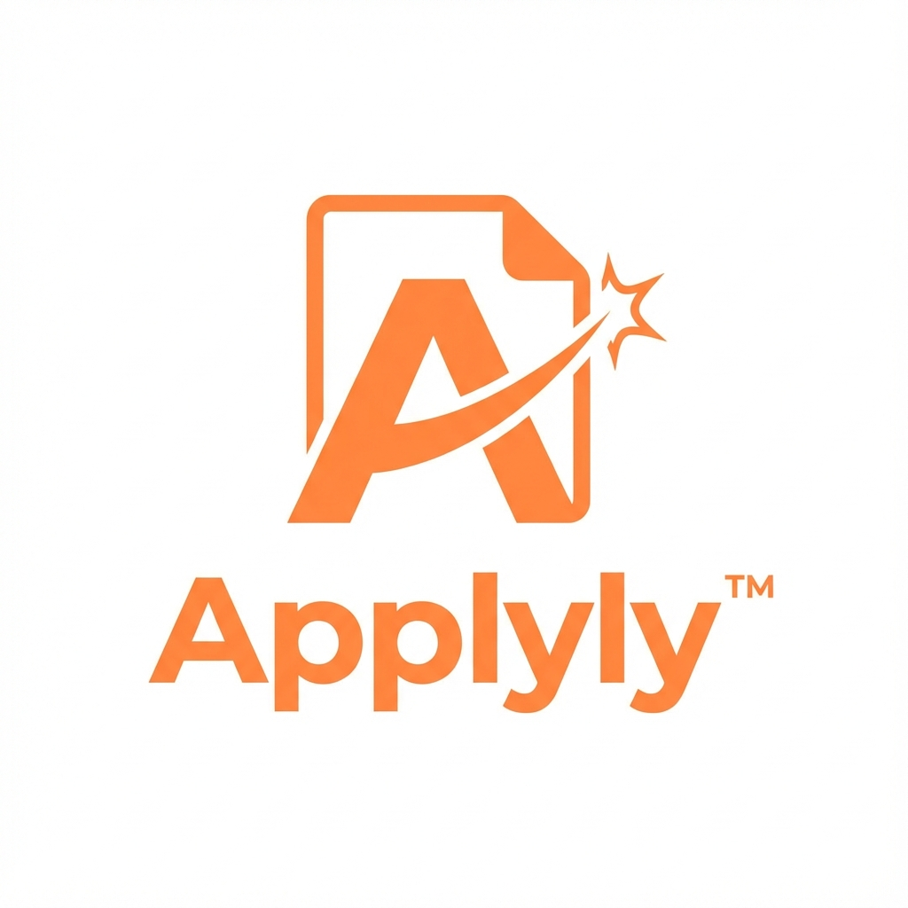
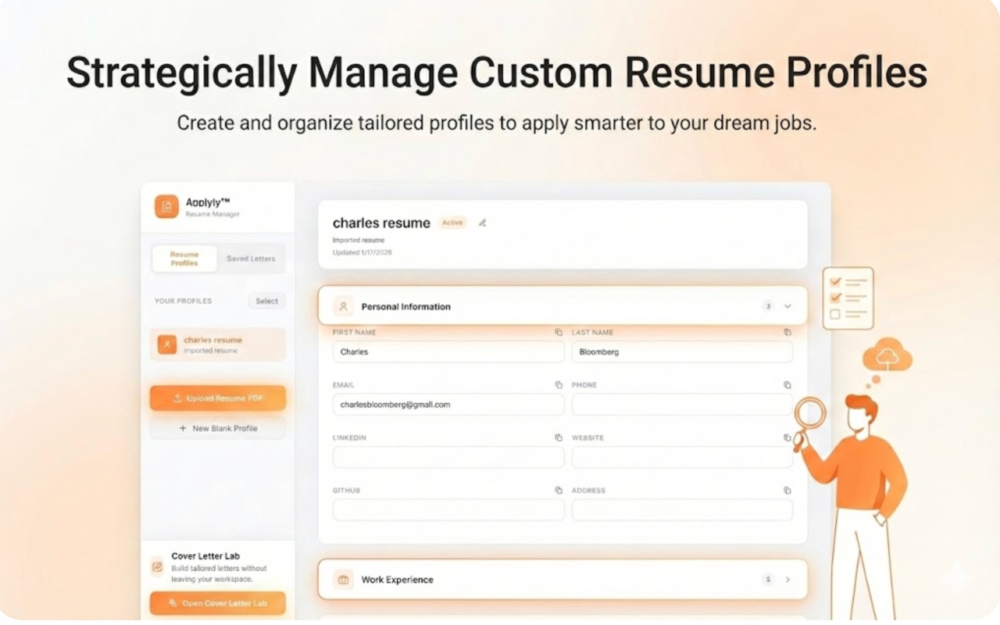
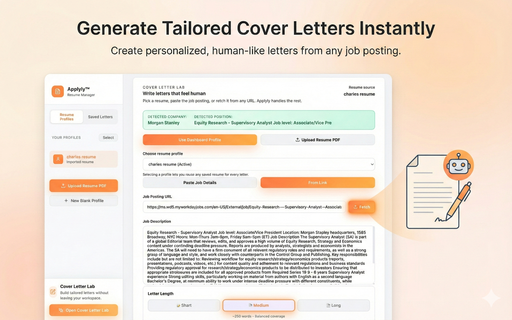
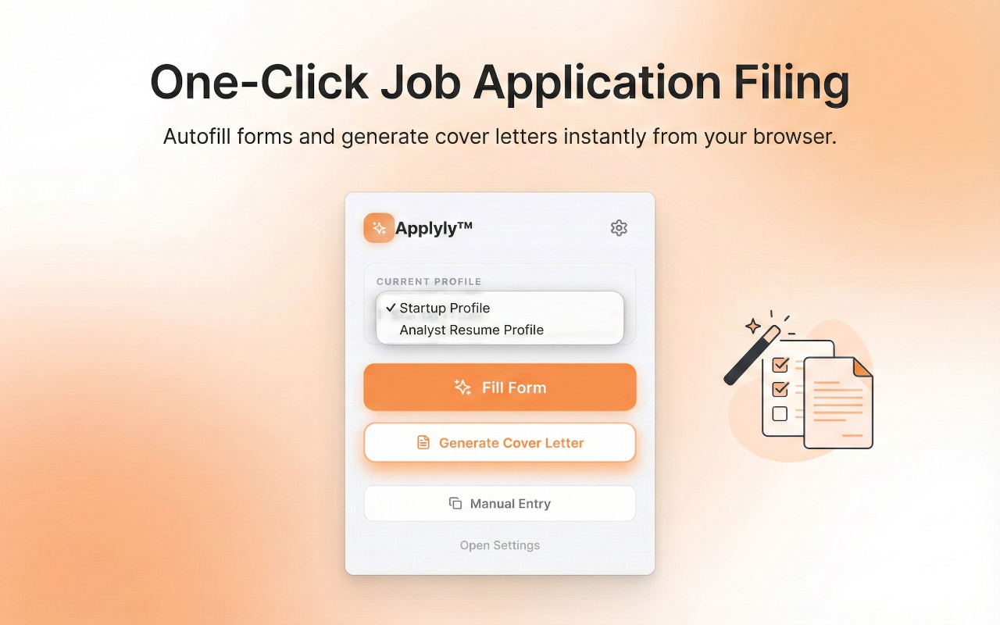
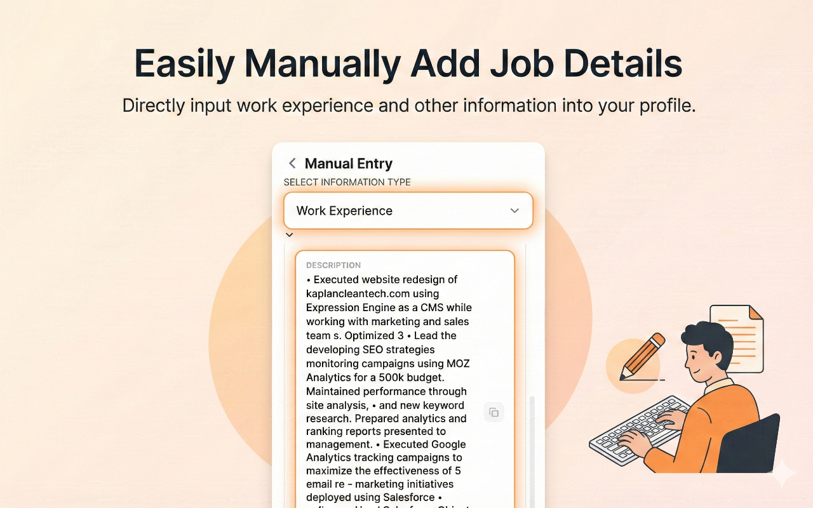

  

# Applyly™

**[Website](https://kkusima.github.io/applyly/) | [GitHub](https://github.com/kkusima/applyly) | [Chrome Web Store](https://chromewebstore.google.com/detail/applyly/jfhblglahmaichgdjaehlgdgocibbmnb)**

Applyly securely stores your resume data locally and helps you ensure every application is filled with your highest quality, curated information. Eliminates repetitive errors and inconsistencies across portals (LinkedIn, Greenhouse, Lever).

## Features

- **Resume Parsing**: Extracts structured data (Education, Work, Skills) from **PDF** resumes.
- **Precision Autofill**: Fills forms with your verified data, preventing typos and fatigue-induced errors.
- **Cover Letter Lab**: Generate tailored cover letters with AI assistance. Customize tone, style, and content to match each job opportunity perfectly.
- **Manual Entry**: Sidebar helper for specific data points.
- **Privacy**: No external servers. All data stays in your browser.

## Screenshots

  
  
  
  

## Installation

Go to the **[Chrome Web Store](https://chromewebstore.google.com/detail/applyly/jfhblglahmaichgdjaehlgdgocibbmnb)** and click **Add to Chrome**.

## Permissions

- `storage`: For saving profiles locally.
- `tabs` & `activeTab`: To detect and fill forms on current pages.
- `scripting`: To execute autofill logic.

## License

Applyly™ © 2026 [Kenneth Kusima](http://tinyurl.com/kennethkusima). All rights reserved.
